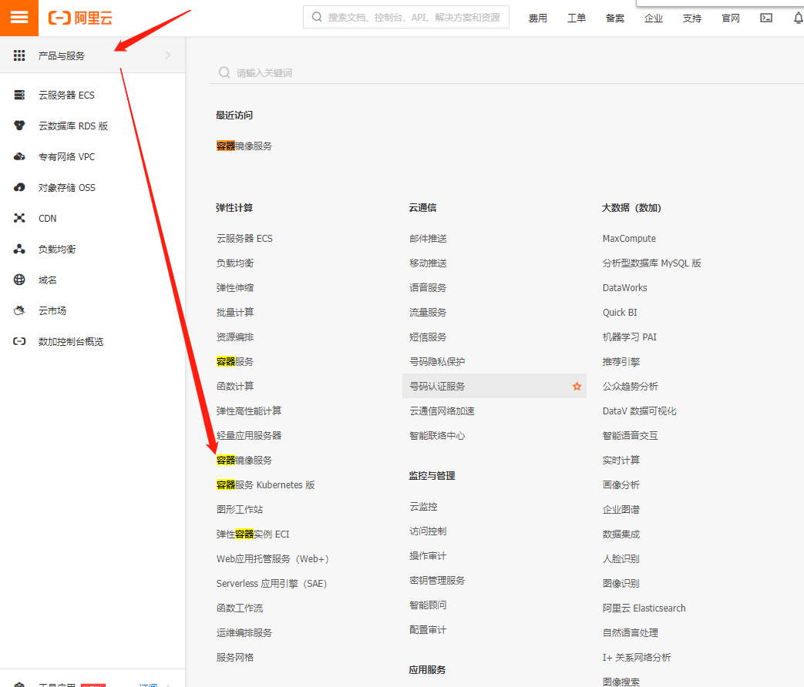
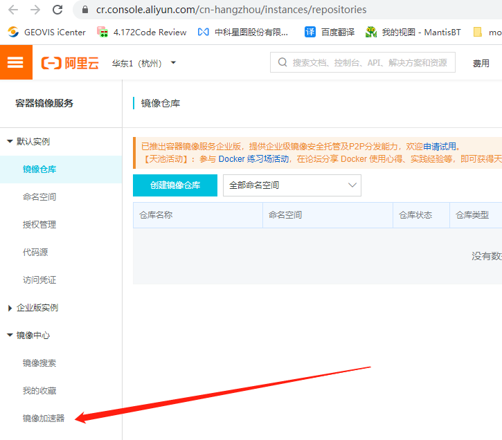
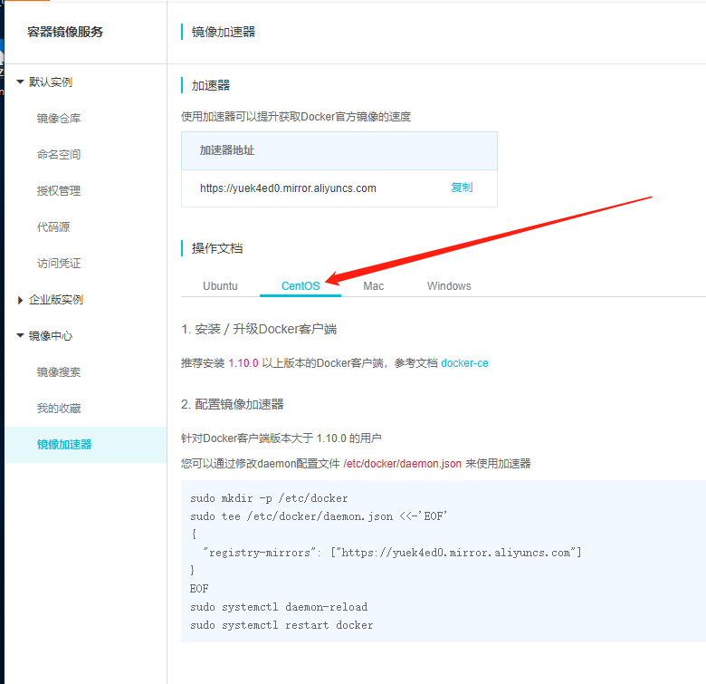

# 简介

-   LXC -- Linux Container
        轻量级的虚拟化
        与宿主机使用同一内核，性能损失小
        不需要指令级的模拟
        不需要即时编译
        轻量隔离，隔离的同时提供共享机制
-   基于Go语言开发

-   docker本质上是一个宿主机的进程
        namespace实现资源隔离
        cgroup实现资源限制
        copy-on-write实现高效的文件操作
    -   namespace的六项隔离
            UTS     主机与域名
            IPC     信号量、消息队列和共享内存
            PID     进程编号
            NETWORK 网络设备、网络栈、端口
            MOUNT   挂载点（文件系统）
            USER    用户组
    -   control Group
            资源限制    对任务的资源总额进行限制
            优先级分配  通过cpu时间片数量与io带宽，相当于控制了任务优先级
            资源统计    统计资源使用
            任务控制    任务挂起恢复
-   镜像（Image）和容器（Container）的关系，就像是面向对象程序设计中的类和实例一样，镜像是静态的定义，容器是镜像运行时的实体。

# centos7 安装docker

```
sudo yum remove docker \
                  docker-client \
                  docker-client-latest \
                  docker-common \
                  docker-latest \
                  docker-latest-logrotate \
                  docker-logrotate \
                  docker-engine
                  
sudo yum install -y yum-utils \
  device-mapper-persistent-data \
  lvm2

sudo yum-config-manager \
    --add-repo \
     http://mirrors.aliyun.com/docker-ce/linux/centos/docker-ce.repo

sudo yum install docker-ce docker-ce-cli containerd.io
```

#### Docker 镜像加速

```
vi  /etc/docker/daemon.json
####################输入#######################
{"registry-mirrors":["https://registry.docker-cn.com"]}
#####################保存#######################

sudo systemctl daemon-reload
sudo systemctl restart docker
docker info
```

阿里云容器镜像服务：->登录https://homenew.console.aliyun.com/ -> 选择容器镜像服务



再选择镜像加速器






#### 问题

##### 替换阿里加速镜像后仍然出现

```
[root@node24 ~]# docker pull centos:7
Error response from daemon: Get https://registry-1.docker.io/v2/: read tcp 192.168.4.24:45338->52.201.142.14:443: read: connection reset by peer
```

网上查询是域名解析的问题，要在hosts文件中配

```dig @114.114.114.114 registry-1.docker.io``` 出的ip

dig安装： ``` yum install bind-utils``` 后docker pull centos就自动好了，原因未知

##### docker info后出现warning

```
WARNING: bridge-nf-call-iptables is disabled
WARNING: bridge-nf-call-ip6tables is disabled
WARNING: the devicemapper storage-driver is deprecated, and will be removed in a future release.
WARNING: devicemapper: usage of loopback devices is strongly discouraged for production use.
         Use `--storage-opt dm.thinpooldev` to specify a custom block storage device.
```

https://yq.aliyun.com/articles/278801

```
vi /etc/sysctl.conf
#####################添加以下内容#######################
net.bridge.bridge-nf-call-ip6tables = 1
net.bridge.bridge-nf-call-iptables = 1
############################################
sysctl -p
```

# 常用

```
docker run ubuntu:15.10 /bin/echo "Hello world"
  # run: 与前面的 docker 组合来运行一个容器。
  # ubuntu:15.10 指定要运行的镜像，Docker 首先从本地主机上查找镜像是否存在，如果不存在，Docker 就会从镜像仓库 Docker Hub 下载公共镜像。
  # /bin/echo "Hello world": 在启动的容器里执行的命令
docker run -it ubuntu:15.10 /bin/bash
  # 交互式的运行镜像
  # 运行 exit 命令或者使用 CTRL+D 来退出容器
docker run -d ubuntu:15.10 /bin/sh -c "while true; do echo hello world; sleep 1; done"
  # 后台运行
docker ps 
  # 查看运行的镜像
  # -a 查看所有镜像
docker logs -f [容器id]
  # 查看镜像中的标准输出
docker stop [容器id]
docker exec -it a9928871a205 /bin/bash
  # 进入容器
docker attach 
  # 与exec相同，但容器的退出会导致容器停止
  
```

#### 容器

```
docker pull ubuntu
  #从远程拉一个镜像
docker export 1e560fca3906 > ubuntu.tar
  # 导出本地容器
cat docker/ubuntu.tar | docker import - test/ubuntu:v1
  # 将快照文件 ubuntu.tar 导入到镜像 test/ubuntu:v1
docker import http://example.com/exampleimage.tgz example/imagerepo
  # 也可以通过指定 URL 或者某个目录来导入
docker rm -f 1e560fca3906
  # 删除容器
docker container prune
  # 清理掉所有处于终止状态的容器
  
```

#### 镜像

```
docker images
  # 查看本地主机上的镜像
docker search httpd
  # 查找httpd镜像
docker rmi [镜像]
  # 删除镜像
```

更新镜像

```
# 创建一个新的容器
docker run -itd --name=test --net host ubuntu bash #net=host使用主机的网络
# 更新镜像
docker commit -m="already update" -a="Morris" [容器id] morris/ubuntu:v2
# 为镜像添加一个新的tag
docker tag [镜像id] morris/ubuntu:dev
```

#### 网络

##### network

```
docker network create -d bridge test-net
docker run -itd --name test1 --network test-net centos /bin/bash
docker run -itd --name test2 --network test-net centos /bin/bash
  # 在test1、test2中可以互相ping到对方
```


##### 端口映射

```
docker run -d -P aWebApp python app.py
  # 容器内的端口全部随机映射到主机的端口
docker run -d -p 127.0.0.1:5001:5000 aWebApp python app.py
  # 指定端口映射
```
参数 ```P``` 将docker，```p``` 则要指定端口


docker exec -it a9928871a205 /bin/bash
docker service ls 
docker service rm xxxxxxxx
docker ps [-a]

docker inspect a9928871a205
docker kill a9928871a205
docker stats 
docker service update --publish-add 6379:6379 xalvvsih21fa


