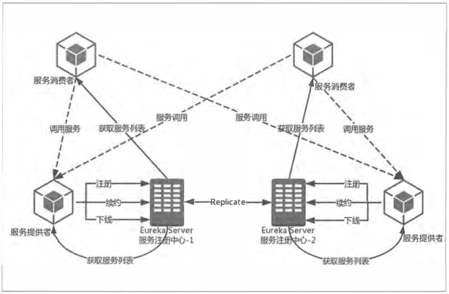

# 基础

#### YAML

​	将属性加载到内存中保存的时候是有序的，所以当配置文件中的信息需要具备顺序含义时， YAML 的配置方式比起 properties 配置文件更有优势。

#### @Value 

​	注解加载属性值的时候可以支持两种表达式来进行配置 ${}或#{}

#### java命令行

​	java -jar xxx.jar --server.part=8888 连续的两个减号就是对配置文件中的属性值进行赋值标识

#### 多环境配置文件

​    满足application-xxx.properties的格式，如application-dev.properties
​        并在application.properties中设置spring.profile.actice=xxx，
​        （默认为dev）以使用其中一个配置文件的内容

##### 各种方式配置的优先级由高到低

1.  ​    命令行传入
2.  ​    SPRING_APPLICATION_JSON系统环境变量（以json格式配置）
3.  ​    java:comp/env中JNDI的属性
4.  ​    java系统属性，通过System.getProperties()获取的内容
5.  ​    操作系统环境变量
6.  ​    通过random.*配置的随机属性
7.  ​    jar包之外通过application-xxx.properties配置的内容
8.  ​    jar包之内通过application-xxx.properties配置的
9.  ​    jar包外的application.properties或yml
10.  ​    jar包内的application.properties或yml
11.  ​    @Configuration注解修饰的类中，通过 @PropertySource注释的属性
12.  ​    应用默认属性，使用SpringApplication.setDefaultProperties设置的内容

# Spring Cloud Eureka

​    注册中心， 每个服务单元向注册中心登记自己提供的服务，将主机与端口号、版本号、通信协议等一些附加信息告知注册中心。服务注册中心还需要以心跳的方式去监测清单中的服务是否可用

​    服务间的调用不再通过指定具体的实例地址来实现， 而是通过向服务名发起请求调用实现

​    C -> A ， C请求注册中心获取所有服务的实例清单，再以某种轮询策略（负载均衡）取出一个实例进行调用Netflix推荐每个可用的区域运行一个Eureka服务端，通过它来形成集群

​        服务注册中心通过异步模式互相复制各自的状态，故每个实例关于所有服务的状态有细微差别EurekaServer的【高可用】实际上就是将自己作为服务向其他服务注册中心注册自己

#### 架构



```
提供方
    服务注册：服务提供方启动时向eureka server发送rest请求，注册自身信息
        eureka.client.register-with-eureka=true默认值，即向eureka注册
    服务同步
        eureka收到注册请求时向其他注册中心转发
    服务续约：服务提供者持续发送心跳，以告知注册中心“我还活着”
        eureka.instance.lease-renewal-interval-in-seconds: 30 #心跳默认值
        eureka.instance.lease-expiration-duration-in-seconds: 90 #失效默认值
调用方
    服务获取：eureka server会维护一只读清单并30s更新一次，以返回给要获取服务的调用方
        eureka.client.fetch-registry=true 调用方必需的
        eureka.client.registry-fetch-interval-seconds=30 #默认值，修改缓存清单更新时间 
    服务下线：服务实例正常关闭时会向eureka server发送请求，告知之
注册中心
    失效剔除：默认每隔60s将清单中超过90s没有续约的服务剔除
    自我保护：本地调试时eureka面板上常常会遇到下述警告，当心跳失败比率在15分钟内低于85%时，
        （单机调试容易满足，生产环境往往由于网络不稳定），会将注册信息保护，让其不会过期。
        EMERGENCY! EUREKA MAY BE INCORRECTLY CLAIMING INSTANCES ARE UP WHEN THEY'RE NOT. RENEWALS ARE LESSER THAN THRESHOLD AND HENCE THE INSTANCES ARE NOT BEING EXPIRED JUST TO BE SAFE.
        故在调试期间常将自我保护关闭
            eureka.server.enable-self-preservation=false
```

#### 配置

实例名配置
    实现在同一主机上， 不指定端口就能轻松启动多个实例的效果
    eureka.instance.instanceid=${spring.application.name}:${random.int}}
健康监测
    pom中引入 spring-boot-starter-actuator
    配置文件 eureka.client.healthcheck.enabled=true
    在设置context-path后，要配置info和health的路径
        management.context-path=/hello
        eureka.instance.statusPageUrlPath=${management.context-path}/info
        eureka.instance.healthCheckUrlPath=${management.context-path}/health

# Spring Cloud Ribbon

#### 自动配置

​     当同时引入Ribbon 与Eureka的依赖时，会触发Eureka对Ribbon的自动化配置

	ServerList 维护机制被com.netflix.niws.loadbalancer.DiscoveryEnableNIWSServerList实例所覆盖
	        将服务清单交给Eureka服务治理机制维护
	IPing      实现被com.netflix.niws.loadbalancer.NIWSDiscoveryPing实例覆盖
	        实例检查交给服务治理框架维护
​    参数配置
​        全局配置 ribbon.ConnectTimeOut=250
​        指定客户端配置 <client>.ribbon.<key>=<value>
​        跨区域容错
​            eureak.instance.metadataMap.zone=shanghai 直接将不同区域的机房配置成不同区域值，以实现跨区域的容错
​        禁用Eureka对Ribbon的服务实例维护的实现，回归到使用<client>.ribbon.listOfServiers参数配置实现
​            ribbon.eureka.enabled=false

#### 重试机制

​        eureka牺牲一定的一致性，在极端情况下，宁愿接受故障，也要保留所有健康的实例

>   ​        CAP理论：一个分布式系统最多只能同时满足一致性（Consistency）、可用性（Availability）和分区容错性（Partition tolerance）这三项中的两项


断路器
​    Application类注解   @EnableCircuitBreaker 或
​    一个三合一注解 @SpringCloudApplication 

# Spring Cloud Hystrix

#### 命令模式

行为请求者与行为实现者的解耦

-   使用情况

    -   先将一个函数登记，以后调用此函数
    -   需要再不同时间指定请求或请求排队。发出请求的一方可能以及不在了，但是命令对象本身仍然可以活动
    -   需要支持命令的撤销。命令对象可以将状态存储，在需要时调用undo()方法将命令产生的效果撤销，或调用redo方法重做
-   系统崩溃时，重新执行命令
    
    ```
    class Invoker{                              //调用者
    	Command command;
    	void action(){command.execute();}
    }
    
    interface Command{void execute();}
    
    class XXXCommand implements Command{        //命令
    	Receiver receiver;
    	void execute(){ receiver.action();}
    }
    
    class Receiver{                             //接收者
    	void action(){
    		//真正的业务逻辑实现
    	}
    }
    ```
    
-   四种执行方式

    -   HystrixCommand
        -   `R execute();`  同步返回一个对象，或者抛出错误
        -   `Future<R> queue();`  异步返回Future
    -   HystrixObservableCommand
        -   `Observable observe();`  返回HotObservable，代表操作的多个结果
        -   `Observale toObservable();`  ColdObservable

观察者-订阅者模式

-   Observable用来向Subscriber对象发布事件，Subscriber则接收事件进行处理

-   一个Observable可以发出多个事件，知道结束或异常

-   每发出一个事件，调用Subscriber的onNext()方法

-   Observable执行最后，调用Subscriber的onCompleted()或onError()方法类结束事件

    ```
    Observable<String> observable = Observable.create(new Observable.OnSubscribe<String>() {
        @Override
        public void call(Subscriber<? super String> subscriber) {
            subscriber.onNext("Hello RxJava");
            subscriber.onNext("this is a test");
            subscriber.onCompleted();
        }
    });
    Subscriber<String> subscriber = new Subscriber<String>() {
        @Override
        public void onCompleted() {System.out.println("success");}
        @Override
        public void onError(Throwable throwable) {System.out.println("error"+throwable.getCause());}
        @Override
        public void onNext(String s) {System.out.println("subscriber: "+ s);}
    };
    observable.subscribe(subscriber);
    ```

#### 断路器原理

```
public interface HystrixCircuitBreaker {
    boolean allowRequest();
    boolean isOpen();
    void markSuccess();
    public static class NoOpCircuitBreaker implements HystrixCircuitBreaker {...}
    public static class HystrixCircuitBreakerImpl implements HystrixCircuitBreaker {...}
    public static class Factory {...}
}
```

-   allowRequest()  Hystrix命令是否要被执行

-   isOpen()  断路器是否打开

-   markSuccesss()  闭合断路器

-   NoOpCircuitBreaker  什么都不做的实现，允许所有请求，断路器始终闭合

-   Factory 维护一个Hystrix命令与HystrixCircuitBreaker的ConcurrentHashMap<String,HystrixCircuitBreaker>

-   HystrixCircuitBreakerImpl  

    HystrixCommandMetrics metrics;  度量指标

    AtomicBoolean circuitOpen; 打开标志

    isOpen()

    -   断路器打开标识是否为true，是则返回true
    -   否则，从度量指标中获取统计对象(默认时间窗10s)进行判断
        -   QPS请求数在阈值内，返回false，circuitBreakerRequestVolumeThreshold 默认20
        -   错误百分比在阈值内，返回false, circuitBreakerErrorThresholdPercentage默认50
        -   否则返回true，


