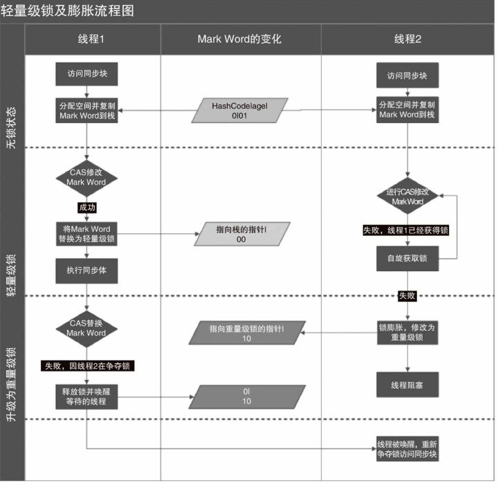

锁

#### 偏向锁

###### 对象头-markWord

-   32位markword


-   64位markword

    

    tip: 是否偏向锁代表偏向锁对于当前对象是否可用

    

-   当A线程访问对象同步块时，先检查对象头中是否存储了自身线程id，cas修改将id偏向自身A，再次进入时只检查线程id是不是偏向自身

-   B线程访问时，发现线程并不是偏向自身，则检查偏向线程A状态，若A线程挂了，则修改其偏向自身B，否则马上执行A线程，检查是否仍需持有锁，是则升级为轻量锁，否则回复成无锁状态

-   https://blog.csdn.net/lengxiao1993/article/details/81568130

-   

#### synchronize与ReentrantLock

-   在引入偏向锁轻量锁前，synchronize性能弱于ReentrantLock

-   ReentrantLock通过循环调用CAS实现加锁

-   特有的功能-应用场景

    -   ReentrantLock可以通过Condition唤醒特定的线程
    -   ReentrantLock可以实现公平锁

        ```java
        Lock lock = new ReentrantLock(true); //公平锁，默认非公平
        ```

    -   ReentrantLock的等待可中断

        ```java
        lock.lockInterruptibly();
        ```

    ```java
    import java.util.concurrent.locks.Condition;
    import java.util.concurrent.locks.Lock;
    import java.util.concurrent.locks.ReentrantLock;
    
    public class TestReentrantLock {
        Lock lock = new ReentrantLock();
        int number = 0;
        class Task implements Runnable{
            int conditionNum;
            Condition pre;
            Condition next;
            String name;
            public Task(int conditionNum, Condition pre, Condition next,String name) {
                this.conditionNum = conditionNum;
                this.pre = pre;
                this.next = next;
                this.name = name;
            }
            @Override
            public void run() {
                lock.lock();
                try {
                    while (number!=conditionNum) {
                        pre.await();
                    }
                    System.out.println(name);
                    number++;
                    next.signal();
                    System.out.println(number);
                } catch (InterruptedException e) {
                    e.printStackTrace();
                }finally {
                    lock.unlock();
                }
            }
        }
    
        public void sout(){
            Condition c1 = lock.newCondition();
            Condition c2 = lock.newCondition();
            Condition c3 = lock.newCondition();
            Task t1 = new Task(1,c1,c2,"t1");
            Task t2 = new Task(2,c2,c3,"t2");
            Task t3 = new Task(3,c3,c1,"t3");
            new Thread(t1).start();
            new Thread(t2).start();
            new Thread(t3).start();
            number++;
        }
    
        @Test
        public void test(){
            TestReentrantLock test = new TestReentrantLock();
            test.sout();
        }
    }
    ```

#### 乐观锁

-   版本号

    数据库表加上version字段，只在提交版本大于当前版本时才更新

-   CAS

    线程变量同步，先比较再更改，原子操作

#### CountDownLatch与CyclicBarrier

-   CountDownLatch

    -   ```latch.await()``` 会阻塞当前线程，直到计数为0

    -   ```latch.countDown()``` 计数减一，减到0也不会报错（不会继续减）

-   CyclicBarrier

    -   example

        ```java
        import java.util.ArrayList;
        import java.util.List;
        import java.util.concurrent.BrokenBarrierException;
        import java.util.concurrent.CyclicBarrier;
        
        public class Barrier {
            CyclicBarrier barrier = new CyclicBarrier(3, new Runnable() {
                @Override
                public void run() {System.out.println("this is a Barrier");}
            });
            class Task implements Runnable{
                CyclicBarrier barrier;
                int taskId;
                public Task(CyclicBarrier barrier, int taskId) {
                    this.barrier = barrier;
                    this.taskId = taskId;
                }
                @Override
                public void run() {
                    try {
                        System.out.println("task:" + taskId);
                        barrier.await();			//barrier处理
                        System.out.println("postTask" + taskId);
                    } catch (InterruptedException | BrokenBarrierException e) { e.printStackTrace(); }
                }
            }
            public void sout(){
                List<Thread> threads = new ArrayList<>();
                for(int i=0; i<3; i++){
                    Thread tmp = new Thread(new Task(barrier,i));
                    threads.add(tmp);
                    tmp.start();
                }
                for(Thread i: threads) {
                    try {
                        i.join();
                    } catch (InterruptedException e) {e.printStackTrace();}
                }
                System.out.println("处理结束");
            }
            @Test
            public void test(){
                new Barrier().sout();
            }
        }
        ```

    -   可以将任务分前后两部分，在任务的中间进行阻塞并做处理

    -   ``` barrier.await();``` 的调用超过设置的次数时，线程会永久阻塞

ThreadLocal与内存泄漏

-   每建立一个ThreadLocal变量相当于在ThreadLocalMap中put了一个key-value

    

-   由于ThreadLocal变量为弱引用，当此变量被设为null时，下次GC时key值就会被回收，而value值由于存在一条强引用的路径不会被回收，故，在线程没有被gc前，value部分就是泄漏的状态

#### 死锁排查

-   ```jps``` 找进程pid

-   ```jstack -l pid > xxx.txt ``` 查看导出的文件，

    发生死锁会有如下日志

    ```
    Found one Java-level deadlock:
    =============================
    "Thread-1":
      waiting for ownable synchronizer 0x000000076c0b7400, (a java.util.concurrent.locks.ReentrantLock$NonfairSync),
      which is held by "Thread-0"
    "Thread-0":
      waiting for ownable synchronizer 0x000000076c0b7430, (a java.util.concurrent.locks.ReentrantLock$NonfairSync),
      which is held by "Thread-1"
    
    Java stack information for the threads listed above:
    ===================================================
    "Thread-1":
    	at sun.misc.Unsafe.park(Native Method)
    	- parking to wait for  <0x000000076c0b7400> (a java.util.concurrent.locks.ReentrantLock$NonfairSync)
    	at java.util.concurrent.locks.LockSupport.park(LockSupport.java:175)
    	at java.util.concurrent.locks.AbstractQueuedSynchronizer.parkAndCheckInterrupt(AbstractQueuedSynchronizer.java:836)
    	at java.util.concurrent.locks.AbstractQueuedSynchronizer.acquireQueued(AbstractQueuedSynchronizer.java:870)
    	at java.util.concurrent.locks.AbstractQueuedSynchronizer.acquire(AbstractQueuedSynchronizer.java:1199)
    	at java.util.concurrent.locks.ReentrantLock$NonfairSync.lock(ReentrantLock.java:209)
    	at java.util.concurrent.locks.ReentrantLock.lock(ReentrantLock.java:285)
    	at pers.morris.??发.DeadLock$2.run(DeadLock.java:36)
    	at java.lang.Thread.run(Thread.java:748)
    ```

#### 线程池

-   

-   当核心线程被占满，继续提交任务会将任务放入队列，
-   队列放不下才会增加线程数量
-   线程数量到达最大数量时会使用RejectedExecutionHandler处理
-   拒绝策略分三种，抛出异常，主线程执行，或者直接丢弃