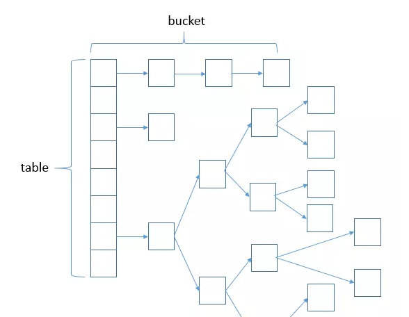
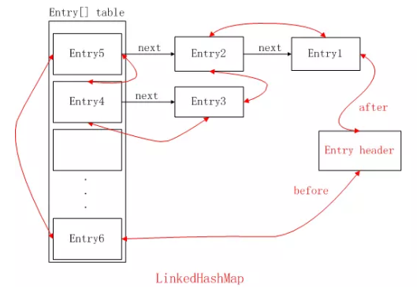
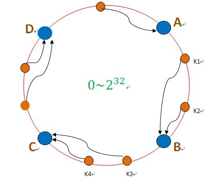
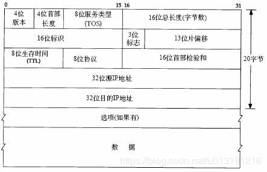
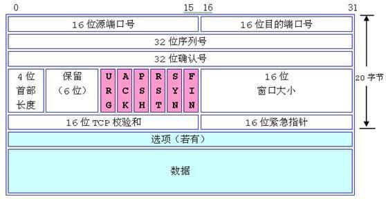
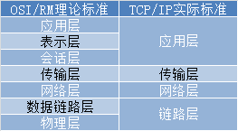

# 操作系统

#### 寻址

-   **直接寻址**：在指令格式的地址的字段中直接指出操作数在内存的地址，而不需要经过某种变换。
-   **立即寻址**：将操作数紧跟在操作码后面，与操作码一起放在指令代码段中，在程序运行时，程序直接调用该操作数，而不需要到其他地址单元中去取相应的操作数。
-   **间接寻址**：间接寻址是相对于直接寻址而言的，指令地址字段的形式地址不是操作数的真正地址，而是操作数地址的指示器。
-   **变址寻址**：变址寄存器的内容(通常是首地址)与指令地址码部分给出的地址(通常是位移量)之和作为操作数的地址来获得所需要的操作数就称为变址寻址。

#### 动态链接

可能发生在程序装载与程序运行时

# 数据库

#### 组合索引

的知识。有一个最左优先的原则，组合索引(a, b, c)，会建立三个索引, (a), (a, b), (a, b, c)。
在查询语句中，

1)where a = xxx 
2)或者 where a = xxx and b = yyy
3)或者where a = xxx and b = yyy and c = zzz
4)或者 where b = yyy and c = zzz and a = xxx

都可以使用索引。第4）中情况可以优化成第3）种。
不包含a的情况，则用不到索引。例如where b = yyy and c = zzz

#### 3NF

第三范式(Third Normal Form,3rd NF)就是指

-   表中的所有数据元素不但要能唯一地被主关键字所标识,
-   所有数据元素必须相互独立,不存在其他的函数关系

 第一范式要求元组的每个分量必须是不可分的数据项。
第二范式要求在第一范式基础上每一个非主属性完全函数依赖于码。
第三范式要求在第二范式基础上每一个非主属性不传递依赖于码。
Boyce-Codd范式要求在第一范式基础上对于每一个非平凡的函数依赖X-Y都有X包含码。
第四范式要求在第一范式基础上对于每一个非平凡的多值依赖X→→Y(Y不是X的子集)都有X包含码。

#### 视图设计

1、自顶向下。先全局框架，然后逐步细化 

2、自底向上。先局部概念结构，再集成为全局结构 

3、由里向外。先核心结构，再向外扩张 

4、混合策略。1与2相结合，先自顶向下设计一个概念结构的框架，再自底向上为框架设计局部概念结构

# java

#### 语法

-   ##### 正确的声明：

```
float f = 1.2f;  //浮点数默认为double型
Float f2 = 1.2f;
double d = 1;
Double d2 = 1.2;  
Double d3 = 1d;   //整型不能直接装箱
Object o = 'x';
char c = '\u7777';
```

类中的final变量必须被初始化

-   ##### 强制性异常

    除RuntimeException外都是强制性异常，即必须被try-catch或throw的异常

-   ##### 反射

    Class类在lang包下

    反射会有额外的永生堆内存开销

-   ##### 权限

    

-   ##### 继承

    -   重写

        子类重写的方法权限不能更低，如父类的public子类不能再声明其为private

        静态方法不能被重写

        重写方法可以抛出新的非强制异常，但是不可以抛出新的强制异常

        子类与父类在同一个包中时，还可以重载默认权限方法

-   面向字符的输入输出都是Reader和Writer的子类

    面向字节的都是InputStream和OutputStream的子类
    

#### 集合

##### Map

###### HashMap

由链表数组组成，链表长度>8则使用红黑树，元素数量>当前容量*加载系数 时进行扩容，

扩容时避免rehash的优化



并发的put时会陷入死循环HashMap#resize() Line:715

jdk1.8后从头插法改为尾插法，消除了1.7死循环的bug

```java
else { // preserve order
    Node<K,V> loHead = null, loTail = null;
    Node<K,V> hiHead = null, hiTail = null;
    Node<K,V> next;
    do {
        next = e.next;
        if ((e.hash & oldCap) == 0) {
            if (loTail == null)
                loHead = e;
            else
                loTail.next = e;
            loTail = e;
        }
        else {
            if (hiTail == null)
                hiHead = e;
            else
                hiTail.next = e;
            hiTail = e;
        }
    } while ((e = next) != null);
    if (loTail != null) {
        loTail.next = null;
        newTab[j] = loHead;
    }
    if (hiTail != null) {
        hiTail.next = null;
        newTab[j + oldCap] = hiHead;
    }
}
```

indexFor(e.hash, newCapacity）//jdk7使用这个重新计算索引的位置

(e.hash & oldCap) == 0 //jdk8通过判断是否为真，不为真：索引=原索引+oldCap

###### ConcurrentHashMap

-   1.8以后 使用CAS（compare and swap）与volatile 的val,next实现

    ```java
    //其内部类
    class Node<K,V> implements Map.Entry<K,V> {
            final int hash;
            final K key;
            volatile V val;
            volatile Node<K,V> next;
    }
    ```

    

###### LinkedHashMap

在HashMap中加入双向链表，记录访问顺序



可以通过重载以下方法来实现LRU算法

```java
protected boolean removeEldestEntry(Map.Entry<Object, Object> eldest) {
	return tooBig = size() > 100;
}
```

###### TreeMap

实现一致性hash算法

```java
import java.nio.ByteBuffer;
import java.nio.ByteOrder;
import java.util.List;
import java.util.SortedMap;
import java.util.TreeMap;

public class ConsistentHashing<Host> {
    private TreeMap<Long, Host> nodes;    //虚拟节点
    private List<Host> hosts;          //真实节点
    private int num;        //每个真实节点对应虚拟节点的数量

    public ConsistentHashing(List<Host> hosts, int num) {
        this.hosts = hosts;
        this.num = num;
        init();
    }

    public Host getHostInfo(String key){
        SortedMap<Long, Host> tail = nodes.tailMap(hash(key,seed)); //顺时针绕一圈找到下一个
        if(tail.size() == 0)
            return nodes.get(nodes.firstKey()); //没找到就返回第一个
        return tail.get(tail.firstKey());
    }

    private void init(){
        nodes = new TreeMap<>();
        for(int i = 0; i<hosts.size();i++){
            Host tmp = hosts.get(i);
            for(int j = 0; j<num; j++){
                nodes.put(hash("host_"+i+"node_"+j,seed),tmp);
            }
        }
    }

    private Long hash(String key, int seed) {
    	//实现一个hash算法
    }

    public void sout(){
        for(long i :nodes.keySet()){
            long j = i/2;
            System.out.println((j+(Long.MAX_VALUE/2))*1.0/(Long.MAX_VALUE)+ " " + nodes.get(i));

        }
    }

}

```

Murmur Hash 一种hash算法

```java
private int seed = 0x1A2B3C4D;

private Long hash(String key, int seed) {
    ByteBuffer keyByte = ByteBuffer.wrap(key.getBytes());
    ByteOrder byteOrder = keyByte.order();

    keyByte.order(ByteOrder.LITTLE_ENDIAN);

    long m = 0xc6a4a7935bd1e995L;
    int r = 47;
    long h = seed ^ (keyByte.remaining()*m);
    long k ;
    while (keyByte.remaining()>=8){
        k = keyByte.getLong();
        k *= m;
        k ^= k>>>r;
        k *= m;

        h ^= k;
        h *= m;
    }
    if (keyByte.remaining() > 0) {
        ByteBuffer finish = ByteBuffer.allocate(8).order(
                ByteOrder.LITTLE_ENDIAN);
        // for big-endian version, do this first:
        // finish.position(8-buf.remaining());
        finish.put(keyByte).rewind();

        h ^= finish.getLong();
        h *= m;
    }

    h ^= h >>> r;
    h *= m;
    h ^= h >>> r;

    keyByte.order(byteOrder);
    return h;
}
```

-   一致性哈希

    问题：为处理海量数据分散压力往往需要多台机器A、B、C、D...

    直接方案：当数据简单取余的按序划分时，不便于拓展，例如当前只有4台机器，扩充到10台就需要对所有的数据重新调整。

    

    一致哈希：将所有的key值形成一个闭环，落在环上的key顺时针寻找节点，如k1储存在B节点，但这样仍有缺陷，当B节点数据激增down掉，所有B的数据涌向C导致C也down掉，最后全部节点就都挂了；故每个实体机器分配多个节点，当作虚拟节点hash到换上，当某个节点挂掉，其中的数据会均匀的分散到各个其他机器上，从而避免了雪崩式的宕机。

    

##### Queue

###### SynchronousQueue

-   自身没有容量，插入操作必须等待移除操作后才能继续插入，移除操作在没有元素插入时会等待
-   不能使用peek操作，返回null
-   iterator()，返回一个空的集合Collections.emptyIterator()
-   两种模式，公平与非公平，公平模式使用FIFO队列，非公平使用LIFO队列（栈）

###### LinkedBlockingQueue

-   自身容量默认无界，基于链表
-   在指定容量后，生产者会在没有空间时阻塞
-   生产者锁与消费者锁分离

###### ArrayListBlockingQueue

-   有界容量
-   使用两个整型来标志队列的头尾
-   生产者消费者锁使用同一个

# 组合数学

偏序集-格


## 网络基础

#### TCP/IP报文

ip报文



    生存时间：由数据报源点设置，每经由一个路由器就减去在路由器消耗的一段时间，
        消耗小于1s就减去1s，TTL=0则丢弃这个数据，防止没有交付的数据无休止的在网络里兜圈子。

tcp报文



#### 端口

TCP **21** 端口： **FTP** 文件传输服务 20用于传输21用于控制
TCP **23** 端口： **TELNET** 终端仿真服务
TCP **25** 端口： **SMTP** 简单邮件传输服务
UDP **53** 端口： **DNS** 域名解析服务
TCP **80** 端口： **HTTP** 超文本传输服务
TCP **110** 端口： **POP3** “邮局协议版本3”使用的端口
TCP **443** 端口： **HTTPS** 加密的超文本传输服务

#### 同步-异步 通信

-   同步

    -   连续串行传送，一次一帧信息
    -   信息帧以同步字符开始，包含若干个字符，一个字符5-8位，一个传输过程中，字符位数相同
    -   一个时间片传送一个字符位数的数据，接收端同样的时间片内接受一个字符位数的数据

-   异步

    -   发送字符时间间隔任意，任意时间开始发送，接收端时刻准备接收
    -   每个字符开始和结束必须加上标志，以保证正确接收每个字符
    -   设备简单、便宜、效率低（开始结束位占比多）

-   区别

    -   同步要求时钟频率一致，且数据连续；异步不要求时钟同步，且不连续发送

    -   同步可点对多点，异步只能点对点

        

#### 信息安全

-   保密性 ： 保证机密信息不被窃取，窃取这不能了解信息含义
-   完整性 ： 数据一致性，防止数据被非法篡改
-   可用性 ： 合法用户可以使用而不被拒绝
-   可控性 ： 出于对国家与社会的利益或需要，保证对信息的控制管理
-   不可否认性 ： 行为实施后，实施者不可否认

#### 网络分层



-   协议 

    应用：FTP、HTTP、HTTPS、

    传输层：TCP、UDP、

    网络层：IP


## 数据结构

-   逻辑结构

    线性-非线性

-   物理结构

    顺序-链式

-   栈

    n个数的出栈序列数： 卡特兰数
    $$
    \mathrm{ h(n)=\frac{C_{2n}^{n}}{n+1}=\frac{2n!}{(n+1)(n!)^2}  }
    $$
    


## 算法

有穷性：在有限步骤后终止

确切性：每一步有明确定义

输入输出：有0个或多个输入且有一个或多个输出

可行性：每个步骤都可分解为可执行的基本步骤，且每个步骤在有限时间内完成